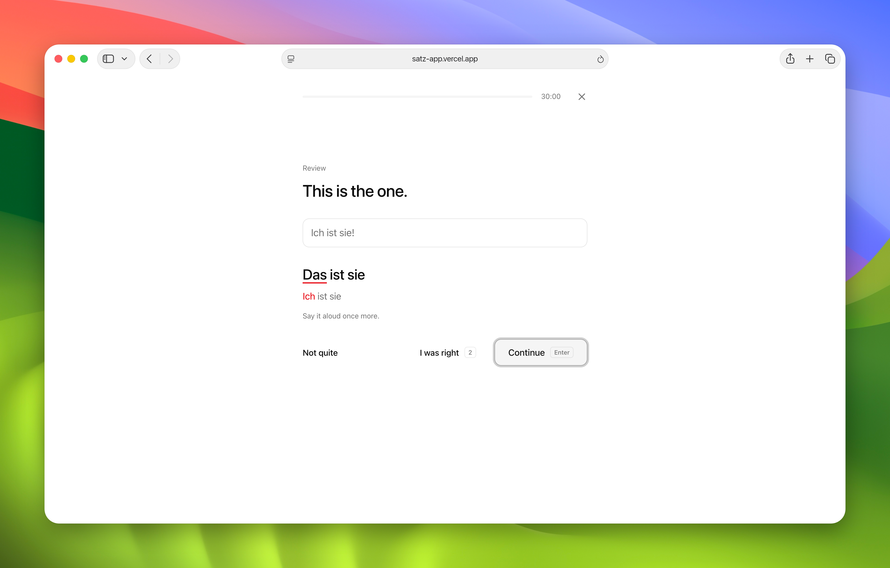
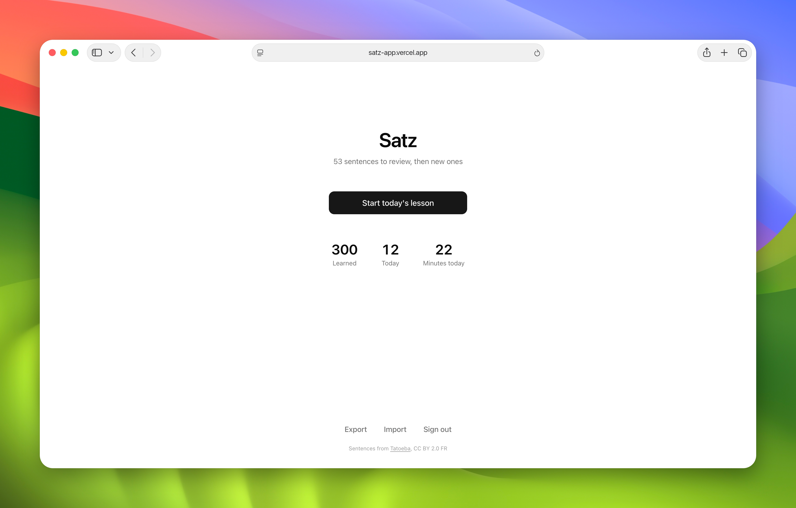
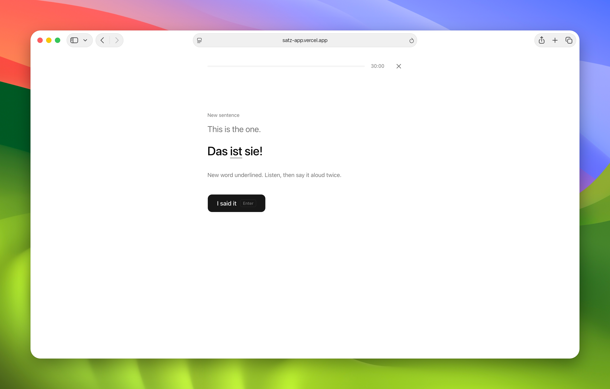
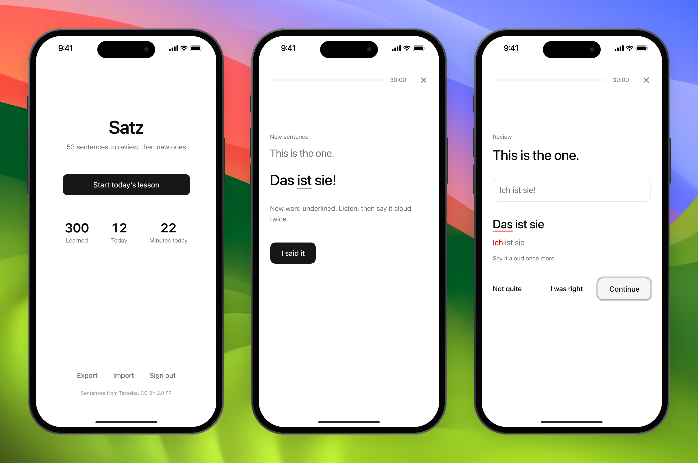

# Satz

<p align="center">
  <picture>
    <source media="(prefers-color-scheme: dark)" srcset="docs/desktop-test-dark.png">
    
  </picture>
</p>

<p align="center">
  <picture>
    <source media="(prefers-color-scheme: dark)" srcset="docs/desktop-home-dark.png">
    
  </picture>
  <picture>
    <source media="(prefers-color-scheme: dark)" srcset="docs/desktop-intro-dark.png">
    
  </picture>
</p>

<p align="center">
  <picture>
    <source media="(prefers-color-scheme: dark)" srcset="docs/phones-dark.png">
    
  </picture>
</p>

Satz teaches German one sentence at a time, in 30-minute lessons. Press one button and study. The app chooses the sentences, reads them aloud in an Austrian voice, and brings each one back just before you would forget it.

Live at [satz-app.vercel.app](https://satz-app.vercel.app). Private: only the owner can sign in.

## How a lesson works

- **New sentences** come from a course of about 14,000, and each one brings exactly one word you have not met yet, the most common first. The new word is underlined. You see the English, read the German, hear it twice, then say it aloud.
- **Tests** show the English. Say the German, type it, and the answer is checked word by word. Typed umlauts (ae, oe, ue, ss) and capital slips still pass. Then say the right sentence aloud once more.
- **Repeats** follow the research on spaced retrieval: a new sentence is tested after about 1 minute and 10 minutes, then scheduled by [FSRS](https://github.com/open-spaced-repetition/ts-fsrs) over days, weeks and months.
- **30 minutes:** reviews come first, new sentences mix in after about 5 minutes and stop at 20, and the last minutes go over what you learned. The clock only counts active study and pauses when you step away. Start another lesson whenever you like.

Progress stays in your browser. Use Export now and then to keep a backup.

## Run it

```sh
npm install
npm run dev
```

## Test

```sh
npm test
npm run test:e2e
```

## Sentences

```sh
python3 scripts/build-sentences.py
```

Rebuilds `public/sentences/` from the latest [Tatoeba](https://tatoeba.org) exports.

## Screenshots

```sh
npm run screenshots
```

Needs Node 22 and [cutaway](https://github.com/half144/cutaway) in `~/.cutaway`.

## Credits

Sentences and translations are from [Tatoeba](https://tatoeba.org), licensed [CC BY 2.0 FR](https://creativecommons.org/licenses/by/2.0/fr/). Each sentence keeps its Tatoeba id and author in `public/sentences/`. Difficulty uses the [FrequencyWords](https://github.com/hermitdave/FrequencyWords) German list (CC BY-SA 4.0) at build time only.

## License

Code: MIT. Sentence data: CC BY 2.0 FR, as above.
