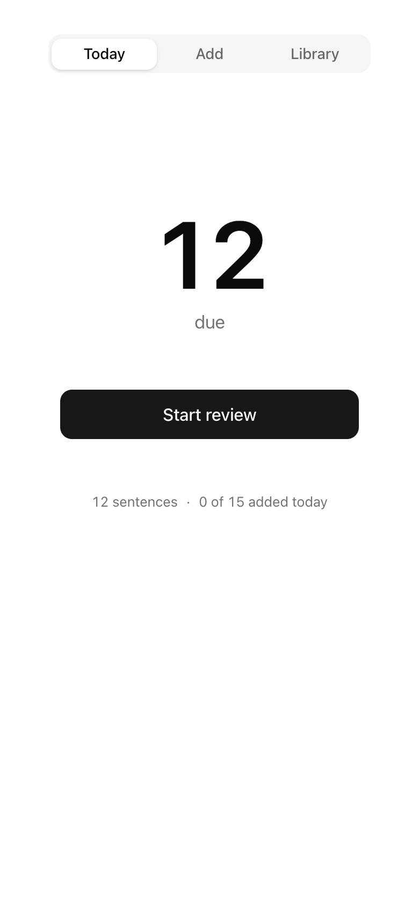
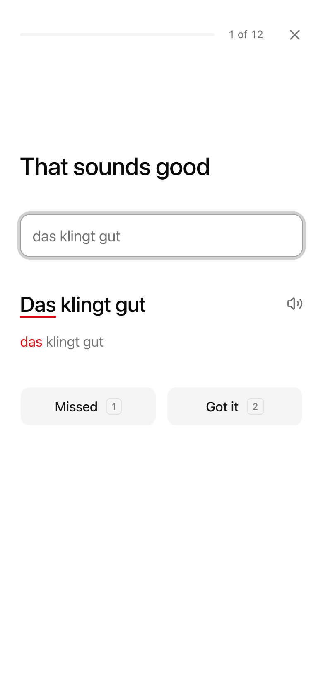
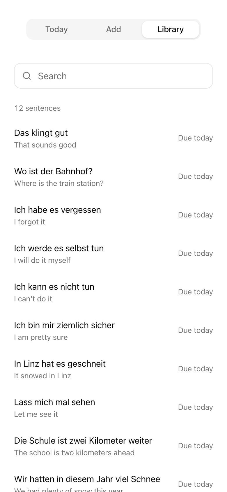

# Satz

<p align="center">
  <picture>
    <source media="(prefers-color-scheme: dark)" srcset="docs/today-dark.png">
    
  </picture>
  <picture>
    <source media="(prefers-color-scheme: dark)" srcset="docs/review-dark.png">
    
  </picture>
  <picture>
    <source media="(prefers-color-scheme: dark)" srcset="docs/library-dark.png">
    
  </picture>
</p>

A quiet web app for memorising German sentences. See the English, type the German from memory, and let spaced review bring each sentence back before you forget it.

Live at [satz-app.vercel.app](https://satz-app.vercel.app). Private: only the owner can sign in.

## Run it

```sh
npm install
npm run dev
```

## How it works

- **Add** sentences as you watch. German, Enter, English, Enter.
- **Today** shows what is due. A correct answer pushes a sentence further out (1, 3, 7, 14, 30, then 60 days). A miss brings it back tomorrow.
- **Library** holds everything, with search, edit, export and import.

Your sentences stay in your browser. Use Export now and then to keep a backup.

The live site is private. Sign-in uses Google and lets in one email address, set in Vercel as `ALLOWED_EMAIL`. Sentences are read aloud with an ElevenLabs voice, and fall back to the browser's German voice when that is not available.

## Test

```sh
npm test
npm run test:e2e
```

## License

MIT
