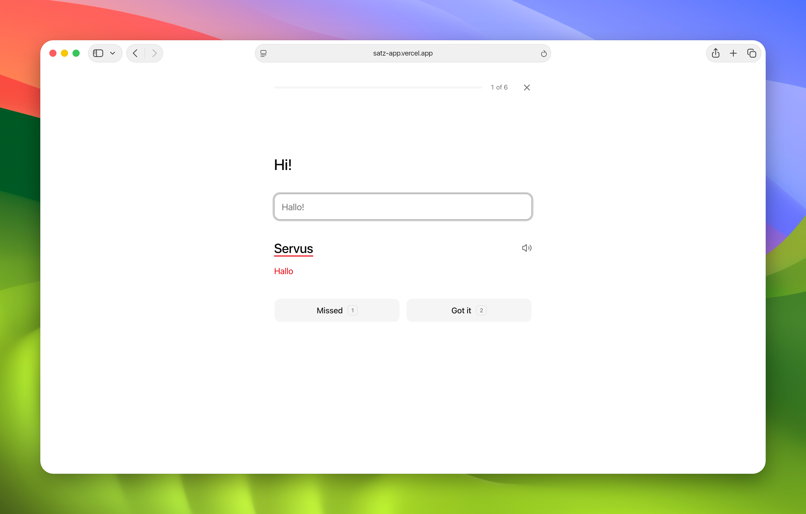
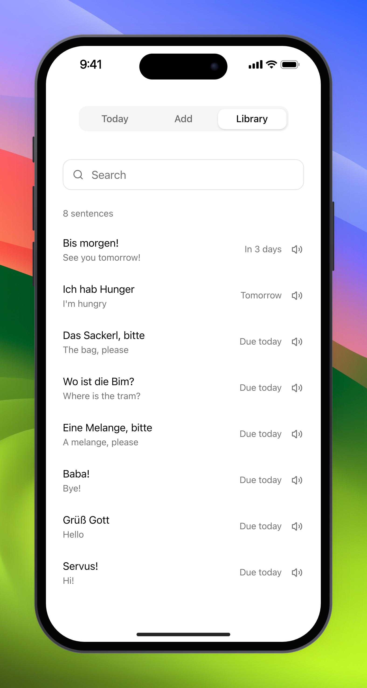

# Satz

<p align="center">
  <picture>
    <source media="(prefers-color-scheme: dark)" srcset="docs/desktop-dark.png">
    
  </picture>
  <picture>
    <source media="(prefers-color-scheme: dark)" srcset="docs/phone-dark.png">
    
  </picture>
</p>

Servus! Satz is a quiet web app for memorising German sentences, the Austrian way. See the English, type the German from memory, hear it in an Austrian voice, and let spaced review bring each sentence back before you forget it.

Live at [satz-app.vercel.app](https://satz-app.vercel.app). Private: only the owner can sign in.

## Run it

```sh
npm install
npm run dev
```

## How it works

- **Add** sentences as you watch. German, Enter, English, Enter.
- **Today** shows what is due. A correct answer pushes a sentence further out (1, 3, 7, 14, 30, then 60 days). A miss brings it back tomorrow.
- **Library** holds everything, with search, edit, export and import.
- **Listen** to any sentence with one click: while you type it, in the library, and after each answer.

Your sentences stay in your browser. Use Export now and then to keep a backup.

The live site is private. Sign-in uses Google and lets in one email address, set in Vercel as `ALLOWED_EMAIL`. Sentences are read aloud by Chris, an Austrian ElevenLabs voice (set `ELEVENLABS_VOICE_ID` to pick another), and fall back to the browser's German voice when that is not available.

## Test

```sh
npm test
npm run test:e2e
```

## Screenshots

```sh
npm run screenshots
```

Screenshots the app with a few Austrian sentences and frames them with [cutaway](https://github.com/half144/cutaway) on a macOS wallpaper. Needs Node 22 and cutaway in `~/.cutaway`.

## License

MIT
